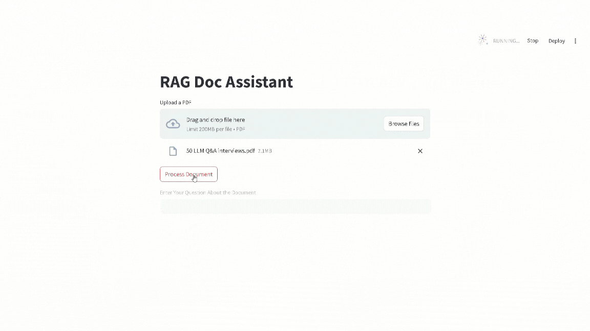

# AI-assistant-using-Langchain-Flask-and-streamlit

Easily extract insights from your documents with this **Retrieval-Augmented Generation (RAG) system**! Upload a PDF, ask questions, and get intelligent answers—all through a user-friendly interface.

## 🛠 Tech Stack

- **Frontend**: Streamlit  
- **Backend**: Flask  
- **Key Libraries**:  
  - `streamlit` - Frontend development  
  - `python-dotenv` - Environment variable management  
  - `groq`, `langchain`, `langchain-community`, `langchain_groq`, `langchain_core` - NLP and RAG capabilities  
  - `pypdf` - PDF parsing and content extraction  

---

## ⚙️ How It Works

1. **Upload**: Add your PDF file through the Streamlit interface.  
2. **Process**: The backend extracts content using `pypdf` and processes queries with `langchain`.  
3. **Ask & Retrieve**: Enter questions about your document and receive concise, relevant answers.
